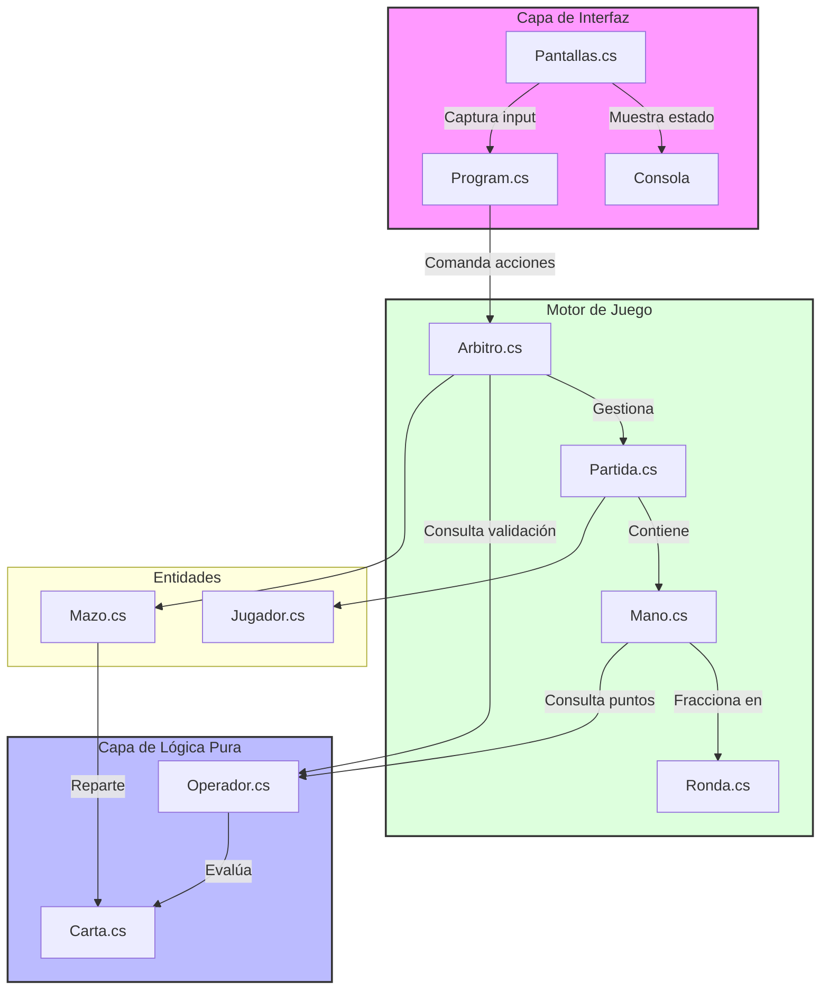

# **Truco Argentino - Core Engine (Console Edition)**

Este proyecto es una implementación del clásico juego de Truco Argentino desarrollada en .NET 9. Aunque nació con una visión multijugador, actualmente se centra en ser un motor de reglas sólido y modular ejecutable por consola, diseñado bajo principios de clean code y C# moderno.

---

## 🚀 Propósito del Proyecto
Demostrar el dominio de las últimas características de C# y la capacidad de modelar una lógica de negocio compleja (el reglamento del Truco) de forma mantenible y desacoplada.

---

## 💻 Stack Tecnológico

- **Lenguaje:** C# 13.

- **Framework:** .NET 9 SDK.

- **Paradigma:** Programación Orientada a Objetos (POO) con un enfoque funcional en el motor de reglas.

---

## 📖 Características Técnicas (The "Flex" Zone)
Para los que vienen a ver el código, aquí destaco lo más interesante:

- **Uso de C# Moderno:** Implementación de Primary Constructors en clases clave como Ronda y Mano, y Records para estructuras de datos inmutables como Carta y Turno.

- **Motor de Reglas Funcional:** La clase Operador actúa como una biblioteca de funciones puras para calcular jerarquías, puntos de envido y sumas de truco, facilitando el testeo y la reutilización.

- **Pattern Matching Avanzado:** Aprovechamiento de las switch expressions para manejar la compleja jerarquía de cartas y las respuestas de los cantos.

- **Arquitectura Desacoplada:** Separación total entre la lógica de juego (Truco.Core) y la interfaz de usuario (Truco.UI), permitiendo cambiar la consola por una interfaz gráfica en el futuro sin tocar el núcleo.

---

## 🏗️ Arquitectura y Flujo de Datos
El diseño del motor se basa en una separación estricta de responsabilidades para garantizar que la lógica del Truco sea independiente de la interfaz de salida.


### Componentes Principales
- *El Árbitro (Orquestador de Estado):* Es la única entidad que conoce el estado global de la mano. Controla el flujo mediante una máquina de estados interna que valida si una acción (cantar truco, jugar carta o envido) es legal en el contexto actual.

- *El Operador (Lógica Pura):* Es un componente estático y sin estado (stateless). Se encarga exclusivamente de las matemáticas del juego: jerarquías de cartas, cálculo de puntos de envido y resolución de valores de los cantos. Al ser lógica pura, facilita enormemente la implementación de pruebas unitarias automáticas.

- *Inmutabilidad con Records:* Se utilizan records para representar entidades como Carta y Turno, asegurando que la información que fluye a través del sistema no sufra efectos secundarios indeseados.

- *Desacoplamiento de UI:* La capa de Pantallas solo tiene acceso de lectura al estado del Arbitro para renderizar la información en consola, pero no puede modificar las reglas del juego directamente.

---

## 📂 Estructura del proyecto
```
src/
├── Program.cs                      # Punto de entrada
├── Truco_Core/                     # Lógica del juego
│   ├── Juego/
│   │   ├── Arbitro.cs             # Controlador principal del juego
│   │   ├── Partida.cs             # Modelo de la partida
│   │   ├── Mano.cs                # Modelo de cada mano
│   │   ├── Ronda.cs               # Modelo de cada ronda (1 carta por jugador)
│   │   └── Turno.cs               # Registro de una jugada
│   ├── Modelos/
│   │   ├── Carta.cs               # Representación de cartas
│   │   ├── Jugador.cs             # Modelo del jugador
│   │   └── Mazo.cs                # Baraja española (40 cartas)
│   └── Reglas/
│       ├── Operador.cs            # Lógica de cálculos (envido, jerarquías)
│       ├── Envido.cs              # Tipos y modelos de Envido
│       └── Truco.cs               # Tipos y modelos de Truco
└── Truco_UI/
    └── Pantallas.cs               # Sistema de visualización en consola
```

---

## ⚙️ Instalación y Ejecución
Asegurate de tener instalado el SDK de .NET 9.
- **Clonar el repositorio:**
  ```bash
  git clone https://github.com/tu-usuario/truco-csharp.git
  ```
- **Entrar a la carpeta del proyecto:**
  ```bash
  cd truco-csharp
  ```
- **Ejecutar el proyecto:**
  ```bash
  dotnet run --project src/Truco_Online_Csharp.csproj
  ```
